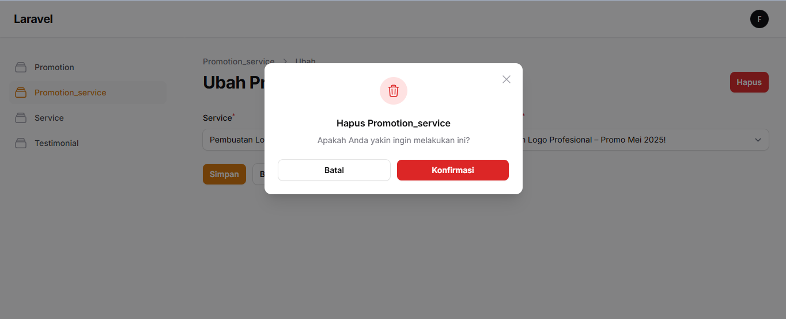

# Nama Proyek

Proyek ini dibangun menggunakan Laravel 11 dan pendekatan **Agile Development**. Sistem memiliki tampilan untuk **User** dan **Admin**, serta dilengkapi dengan dokumentasi teknis seperti **Use Case Diagram**, **Sequence Diagram**, dan **ERD (Entity Relationship Diagram)**.

---

## 📦 Teknologi yang Digunakan

- **Laravel 11** – Framework utama backend
- **MySQL** – Database sistem
- **FilamentPHP** – Admin panel dan manajemen data
- **TailwindCSS** – Styling frontend
- **jQuery** – Interaktivitas frontend
- **Laravel Debugbar** – Debugging dan profiling

---

## 📁 Struktur Proyek (Highlight)

- `/app` – Kode utama aplikasi
- `/resources/views` – Blade Templates (Frontend)
- `/public` – Folder untuk akses publik (gambar, assets)
- `/routes/web.php` – Rute aplikasi
- `/database/migrations` – Struktur database

---

## 🧪 Metodologi Pengembangan

Proyek dikembangkan dengan metode **Agile**, menggunakan pendekatan iteratif dan inkremental. Pengembangan dilakukan dalam beberapa sprint kecil, dengan pengujian dan evaluasi berkelanjutan.

---

## 📸 UI Tampilan

### 🧍 UI - User

  
  
  
  
  
  
  


### 🛠️ UI - Admin

  
  
  
  
  
  
  
  
  
  
  
  
  
  
  
  
  
  
  


---

## 🗃️ Alur Database (ERD)


---

## 🔄 Sequence Diagram


---

## 📌 Use Case Diagram


---

## ⚙️ Instalasi & Setup

```bash
git clone https://github.com/namauser/namaproject.git
cd namaproject
composer install
cp .env.example .env
php artisan key:generate

# Setup Database
php artisan migrate --seed

# Jalankan server
php artisan serve
